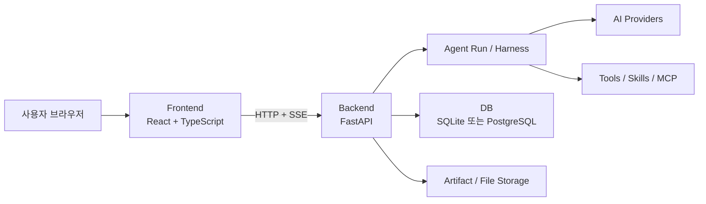

# Lumina Agent

**LUMINA — Language Understanding, Model Integration, Navigation & Automation**

사용자의 언어와 의도를 이해하고, AI 모델을 도구·데이터·실행 환경과 연결하여 작업을 완수하는 AI Harness Agent입니다.

> **Understand. Connect. Navigate. Act.**

Lumina Agent는 사내 환경에서 여러 사용자가 AI Agent를 안전하게 실행하고, 대화·파일·산출물·확장 기능을 하나의 작업공간에서 관리할 수 있도록 만든 Agent Harness 기반 웹 애플리케이션입니다.

React 기반 Frontend와 FastAPI 기반 Backend를 한 서비스처럼 제공하며, Agent 실행은 Backend가 소유합니다. 사용자가 다른 대화로 이동하거나 브라우저를 닫아도 Run은 계속되고, 다시 접속하면 진행 상태와 결과를 복원합니다.

> 현재 버전은 `0.1.0` 개발 단계입니다. 로컬에서는 SQLite와 내장 Mock Provider로 전체 흐름을 실행할 수 있으며, 운영 환경은 PostgreSQL과 서버 측 Secret 주입을 전제로 합니다.

## 주요 기능

- Project별 대화, 사용자 파일 저장소, 지침, Memory와 Artifact 관리
- 세션을 이동하거나 다시 접속해도 이어지는 Background Agent Run
- Provider·Model·Effort 선택과 사용자별 마지막 선택 복원
- OpenAI, Codex, P-GPT, Anthropic, Gemini 및 OpenAI Compatible Provider
- `@파일명`·`@폴더명` Context 연결과 `$Skill`·`$MCP` 명시 호출
- Tool 실행 상태, 승인 요청, Plan과 단계별 진행 상황 표시
- 채팅 안의 인라인 이미지, 확대 가능한 Mermaid와 구조화된 인터랙티브 데이터 차트
- DOCX, XLSX, PPTX, PDF, HTML, Markdown 산출물 생성과 검증
- 대화 검색, 분기, 내보내기와 읽기 전용 공유
- 계정별 설치, 사용자별 WorkingDraft와 복수 Owner를 지원하는 Skill·MCP Marketplace
- 예약 작업, 사용자·Project Memory와 대화 즐겨찾기·좋아요
- 가입 요청 승인과 사용자·Provider·MCP·조직 지침 관리

## 설계 개요

### 업무 계층

Lumina의 기본 업무 단위는 다음 계층을 따릅니다.

```text
Organization
└─ Project                 파일·지침·Memory·허용 확장의 격리 경계
   └─ Session              하나의 대화와 실행 Queue
      └─ Run               한 요청의 재현 가능한 Agent 실행 기록
         ├─ Plan / Step
         ├─ Tool execution
         └─ Artifact
```

같은 Session에는 기본적으로 하나의 Run만 실행하고 추가 요청은 Queue에 넣습니다. 서로 다른 Session의 Run은 사용자 및 서버 동시 실행 한도 안에서 병렬로 처리합니다.

### 시스템 경계



- **Frontend**는 채팅, Run 진행 상태, Tool 승인, Artifact Preview와 관리 화면을 표시합니다.
- **Backend**는 인증·권한, DB, Session Queue, Event replay, Provider 선택과 파일 접근을 검증합니다.
- **Agent Run**은 Plan, 모델 호출, Tool 실행, 중단·재개와 실행 한도를 관리합니다.
- **Provider**는 외부 모델별 인증과 프로토콜 차이를 Adapter 경계 안에 격리합니다.
- **Storage**는 서버의 데이터를 원본으로 관리합니다. 브라우저 다운로드는 원본을 변경하지 않는 명시적 내보내기입니다.

초기 배포는 Backend와 Agent 실행기를 함께 두는 Modular Monolith입니다. API와 Worker의 논리적 경계는 유지하므로 필요할 때 별도 Worker와 Queue로 분리할 수 있습니다.

### 상태와 보안 원칙

- 사용자 데이터는 기본적으로 사용자와 Project 범위로 격리합니다.
- Frontend가 보낸 파일 경로, Skill 이름과 MCP 이름은 Backend에서 다시 권한을 검사합니다.
- Run은 Provider, Model, Effort, 지침, 확장 버전과 관리자 실행 안전 한도를 snapshot으로 고정합니다. 기본 한도는 Run당 400 model Turn, 총 4,000,000 Token, 10,080분, 예상 비용 $100이며 관리자가 조정할 수 있습니다.
- API Key, 비밀번호, 인증 토큰과 회사 인증서는 Git, 로그와 Run event에 기록하지 않습니다.
- 회사 CA는 public CA와 결합한 Trust Manager를 사용하며 TLS 검증을 끄지 않습니다.
- Provider·Model·Effort의 마지막 선택은 브라우저가 아니라 서버 DB에 저장합니다.

## 빠른 시작

### 요구 환경

| 필요한 프로그램 | 설치 안내 |
|---|---|
| Windows 10/11과 PowerShell | Windows에 기본 포함되어 있으므로 별도로 설치하지 않아도 됩니다. |
| Python 3.13 | [`Python 공식 Windows 다운로드`](https://www.python.org/downloads/windows/)에서 최신 Python 3.13.x의 **Windows installer (64-bit)**를 설치합니다. 직접 설치하지 않아도 `uv`가 필요한 Python 3.13을 자동으로 내려받을 수 있습니다. |
| `uv` | 인터넷에 연결되어 있으면 `installer.bat`가 없을 때 Astral 공식 PowerShell 명령으로 자동 설치합니다. 실패한 경우 [`uv 공식 설치 안내`](https://docs.astral.sh/uv/getting-started/installation/)를 따릅니다. |
| Node.js와 npm | [`Node.js 공식 다운로드`](https://nodejs.org/en/download)에서 **Node.js 20.19.0 이상인 LTS** 버전을 설치합니다. `npm`은 Node.js 설치에 포함되므로 따로 설치하지 않습니다. |

처음 설치한다면 다음 순서가 가장 간단합니다.

1. Node.js 공식 다운로드 페이지에서 **LTS** Windows Installer를 내려받아 기본 옵션으로 설치합니다. `npm`도 함께 설치됩니다.
2. 저장소 루트에서 `installer.bat`를 실행합니다. `uv`가 없고 인터넷에 연결되어 있으면 설치기가 Astral 공식 명령으로 사용자 폴더에 자동 설치합니다.
3. 설치 후 아래 명령으로 설치 상태를 확인합니다.

   ```powershell
   uv --version
   node --version
   npm --version
   uv python install 3.13
   uv run --python 3.13 python --version
   ```

마지막 명령이 `Python 3.13.x`를 표시하면 준비가 끝난 것입니다. 명령을 찾을 수 없다는 메시지가 나오면 PowerShell을 완전히 닫았다가 다시 열어 보십시오.

#### 회사 CA 인증서

회사 네트워크에서 P-GPT, Web Search 또는 외부 HTTPS 연결을 사용할 때 회사의 TLS 검사 인증서를 신뢰해야 한다면 회사 CA 인증서가 필요합니다. 일반 공개 인터넷 연결만 사용하고 인증서 오류가 없다면 이 설정은 생략할 수 있습니다.

인증서는 사내 IT 또는 보안 부서가 승인한 **PEM 형식의 `.crt` 인증서 또는 certificate chain**을 사용해야 합니다. 파일 안에는 `-----BEGIN CERTIFICATE-----`가 있어야 하며 private key가 포함되어서는 안 됩니다. 인터넷에서 임의의 인증서를 내려받아 사용하지 마십시오.

Lumina는 다음 순서로 회사 CA 인증서를 찾습니다.

1. `.env`의 `LUMINA_CA_CERT`에 설정된 경로
2. 저장소의 `data\certs\company-ca.crt` — 새 설치의 권장 위치
3. `C:\POSCO_CA.crt` — 기존 회사 PC 호환용 fallback

가장 간단한 방법은 인증서를 저장소의 `data\certs\company-ca.crt`에 복사한 다음 `installer.bat`를 실행하는 것입니다. 인증서를 다른 승인된 위치에 보관하려면 다음과 같이 경로를 지정할 수 있습니다.

```powershell
installer.bat -CompanyCaPath "C:\approved\company-ca.crt"
```

설치기는 public CA와 회사 CA를 결합한 `data\certs\runtime\combined-ca.pem`을 생성하고 `.env`의 `LUMINA_CA_BUNDLE`에 기록합니다. 회사 CA가 발견된 Windows 설치에서는 OpenSSL 3와 사내 TLS inspection chain의 호환을 위해 `LUMINA_TLS_COMPAT_MODE=true`도 저장합니다. 이 모드는 해당 trust profile에서 security level과 strict chain flag만 제한적으로 완화하며 TLS 인증서 검증 자체는 유지합니다. 생성된 bundle을 직접 편집하거나 TLS 오류를 `verify=False`로 우회하지 마십시오.

실제 인증서, combined bundle과 private key는 Git에 커밋하지 않습니다. 회사 CA가 반드시 필요한 설치에서는 `-RequireCompanyCa`를 함께 사용하면 인증서를 찾지 못하거나 검증에 실패할 때 설치가 중단됩니다.

```powershell
installer.bat -CompanyCaPath "C:\approved\company-ca.crt" -RequireCompanyCa
```

Office/PDF Artifact를 실제 페이지로 렌더링해 검증하려면 LibreOffice와 Poppler의 `pdftoppm`도 `PATH`에 있어야 합니다. 이 도구가 없어도 구조 검증은 수행하지만 렌더 검증은 보류 상태로 표시됩니다.

### 1. 설치

저장소 루트에서 다음 파일을 실행합니다.

```powershell
installer.bat
```

설치기는 다음 작업을 수행합니다.

- Python과 Frontend 의존성 설치
- `data/` 작업 디렉터리 생성
- `.env.example`을 기반으로 `.env` 생성
- Alembic migration 적용
- Frontend production build
- 선택적으로 P-GPT credential과 회사 CA 설정

설치기는 첫 `uv` 네트워크 작업 전 `UV_SYSTEM_CERTS=true`를 적용합니다. 따라서 회사 TLS inspection 인증서가 Windows 인증서 저장소에 등록된 PC에서는 Python 3.13 다운로드와 Python dependency 설치도 시스템 trust store를 사용합니다. TLS 인증서 검증을 끄지는 않습니다.

기존 `.env`는 통째로 덮어쓰지 않습니다. 비밀값은 `.env` 또는 Process Environment에만 저장하고 저장소에 커밋하지 마십시오.

설치 전 조건만 확인하려면 파일과 DB를 변경하지 않는 검증 모드를 사용할 수 있습니다.

```powershell
installer.bat -NonInteractive -SkipPgpt -NoNetwork -ValidateOnly
```

### 2. 실행

일반 실행:

```powershell
run_lumina.bat
```

브라우저에서 [http://127.0.0.1:5253](http://127.0.0.1:5253)을 엽니다.

Frontend와 Backend를 개발 모드로 실행:

```powershell
run_lumina_dev.bat
```

개발 모드의 주소는 다음과 같습니다.

- Frontend (현재 PC): [http://127.0.0.1:5252](http://127.0.0.1:5252)
- Frontend (같은 네트워크): 실행 창에 표시되는 `http://<현재 PC의 IP>:5252/`
- Backend API: [http://127.0.0.1:5253](http://127.0.0.1:5253)

Frontend와 Backend 포트는 루트 `.env`의 `LUMINA_FRONTEND_PORT`, `LUMINA_BACKEND_PORT`로 각각 바꿀 수 있습니다. 기본값은 `5252`, `5253`이며 서로 다른 번호를 사용해야 합니다. 값을 저장한 뒤 실행기를 다시 시작하면 Frontend 링크와 API proxy가 새 포트를 사용합니다. 다른 PC에서 접속하려면 같은 네트워크에 연결되어 있어야 하며 Windows 방화벽에서 Frontend TCP 포트의 인바운드 연결을 허용해야 합니다.

실행 창에서 `r`, `R` 또는 `ㄱ`을 입력하면 Frontend와 Backend를 함께 재시작합니다.
Backend나 Frontend process가 예기치 않게 종료되거나 health check가 연속 실패하면 실행기가 자동으로 다시 시작합니다. 반복 장애 때는 재시작 간격을 최대 30초까지 늘리며, 사용자가 실행기를 종료할 때까지 감시를 계속합니다. 직전 process 로그는 `data/logs/*.previous.log`에 보존됩니다.

### 3. 로그인

개발 환경의 Bootstrap 계정은 다음과 같습니다.

```text
아이디: admin@posco.com
비밀번호: 1
```

이 계정은 로컬 개발용입니다. 운영 배포 전에 Bootstrap 비밀번호를 변경하고, 일반 사용자에게 관리자 계정을 공유하지 마십시오.

## 사용 방법

### 대화 시작

1. 왼쪽의 **에이전트** 화면에서 새 대화를 만듭니다.
2. Composer 아래에서 Provider, Model과 Effort를 선택합니다.
3. 질문을 입력해 Run을 시작합니다.
4. 응답 중에는 현재 Step, Tool 실행과 경과 시간을 확인할 수 있습니다.
5. 위험한 Tool 실행은 승인 요청을 검토한 뒤 허용하거나 거부합니다.

다른 대화로 이동해도 실행 중인 Run은 중단되지 않습니다. 원래 대화로 돌아오면 Backend snapshot과 event replay를 기준으로 진행 상태가 복원됩니다.

### 파일과 확장 기능 연결

Composer에서 다음 문법을 사용합니다.

```text
@분기보고서.pdf의 핵심 위험을 요약해 주세요.
@점검자료 폴더를 참고해 설비별 주의사항을 정리해 주세요.
$회의록작성 이 대화를 회의록으로 정리해 주세요.
$사내검색 최근 관련 규정을 찾아 주세요.
```

- `@`는 현재 Project에서 접근 가능한 파일, 폴더 또는 Artifact를 Context에 연결합니다.
- `$`는 설치되고 허용된 Skill 또는 MCP를 명시적으로 호출합니다.
- 자동완성에서 항목을 선택하면 이름이 아니라 Backend 검증용 참조 ID가 Run에 전달됩니다.

### 주요 화면

| 화면 | 용도 |
|---|---|
| 에이전트 | 대화, Run, Tool 실행과 Artifact 작업 |
| 마켓스토어 | Skill과 MCP 탐색·설치·관리 |
| 라이브러리 | 생성된 Artifact 검색, Preview와 다운로드 |
| 파일 | 사용자가 제공하는 Project 파일·폴더 업로드, 탐색, Preview와 Context 관리 |
| 예약 작업 | 반복 또는 지정 시각 작업 관리 |
| Memory | 사용자 및 Project 학습 항목 검토 |
| 관리 | 사용자, Provider, MCP와 조직 운영 상태 관리 |
| 설정 → 관리자 설정 | Model별 토큰 설정, Run 안전 한도와 비상 전체 중단 관리 |

### 결과 저장과 공유

- 답변 또는 생성 결과를 Artifact로 저장하면 서버 작업공간이 원본을 보관합니다.
- 다운로드는 브라우저에 복사본을 내보내며 서버 원본과 version을 변경하지 않습니다.
- 답변 아래 공유 버튼은 현재 답변까지의 읽기 전용 링크를 즉시 복사합니다. 링크는 다른 대화나 Project 권한을 함께 주지 않습니다.
- 답변 아래 의견 버튼으로 개선 의견을 게시할 수 있으며, 관리자는 관리 화면의 대화 탭에서 의견이 있는 대화만 필터링해 확인합니다.

## Provider 설정

실제 Provider를 사용하려면 설치 후 루트 `.env`에 필요한 값만 설정합니다.

| Provider | 주요 설정 |
|---|---|
| Codex | 로컬 Codex App Server의 ChatGPT OAuth (`codex login`) |
| OpenAI | `OPENAI_API_KEY` |
| Anthropic | `ANTHROPIC_API_KEY` |
| Gemini | `GOOGLE_API_KEY` |
| OpenAI Compatible | `LUMINA_OPENAI_COMPATIBLE_BASE_URL`, `LUMINA_OPENAI_COMPATIBLE_API_KEY` |
| P-GPT | `PGPT_API_KEY`, `PGPT_EMPLOYEE_NO`, `PGPT_COMPANY_CODE` |
| 회사 CA | `LUMINA_CA_CERT` 또는 `LUMINA_CA_BUNDLE` |

P-GPT의 기본 endpoint는 코드에 정의된 사내 profile을 사용하며, `PGPT_BASE_URL`은 관리자 override가 필요할 때만 설정합니다. 새로 발견한 Provider 모델은 자동으로 활성화하지 않고 관리자가 검증한 카탈로그 항목만 사용자에게 노출합니다.

Codex는 ChatGPT 구독 사용량을 쓰며 `OPENAI_API_KEY`로 자동 전환하지 않습니다. 현재 공개 Codex App Server에서 검증된 초기 모델은 `GPT-5.5`와 `GPT-5.4`입니다. Provider credential을 설정하지 않은 개발 환경에서는 deterministic Mock Provider를 사용해 대화, Tool, Plan과 Artifact 흐름을 검증할 수 있습니다.

## 개발과 검증

Backend 테스트:

```powershell
$env:PYTHONPYCACHEPREFIX = "$PWD\.cache\pycache"
uv run --project apps/server pytest -c apps/server/pyproject.toml
```

Frontend 단위 테스트, typecheck와 build:

```powershell
npm --prefix apps/web test
npm --prefix apps/web run typecheck
npm --prefix apps/web run build
```

Backend 전체 테스트는 Alembic 최신 head까지의 migration, Agent Loop, Provider adapter, 권한·공유 경계와 Artifact 흐름을 검증합니다. Frontend 단위 테스트는 UI helper와 화면 계약을 빠르게 검사하며, 실제 화면을 바꾸는 작업은 별도의 브라우저 점검도 수행해야 합니다. 조건부 renderer·PostgreSQL 테스트와 테스트 전용 포트 규칙은 [설치와 진단](docs/project-context/INSTALLATION_AND_DIAGNOSTICS.md#개발-검증)을 참고하십시오.

네트워크를 사용하지 않는 환경 진단:

```powershell
uv run --project apps/server python -m lumina.diagnostics --no-network
```

PostgreSQL dialect 호환성 검사:

```powershell
powershell -ExecutionPolicy Bypass -File devtools/check_postgres_compat.ps1
```

Health endpoint:

- `GET /api/health/live`: Process와 실행기 생존 확인
- `GET /api/health/ready`: DB 연결과 요청 처리 준비 상태 확인

## 저장소 구조

```text
lumina-agent/
├─ apps/
│  ├─ web/                   React + TypeScript Frontend
│  └─ server/                FastAPI, Agent Runtime와 Provider
├─ data/                     로컬 DB, 파일, Artifact와 인증서; Git 제외
├─ docs/                     상세 설계와 기능별 계약
├─ extensions/               Plugin, Skill과 MCP 자원
├─ infra/                    컨테이너와 배포 설정
├─ devtools/                 설치, 실행, 진단과 유지보수 도구
├─ tests/                    Backend, Frontend, E2E와 Eval
├─ installer.bat             Windows 설치 진입점
├─ run_lumina.bat            일반 실행 진입점
└─ run_lumina_dev.bat        개발 실행 진입점
```

`.examples/`는 외부 프로그램을 분석하기 위한 참고 전용 자료이며 Lumina의 import, build, test, package 또는 배포 대상이 아닙니다.

## 상세 문서

README는 제품 구조와 실제 사용 절차만 설명합니다. 구현 계약과 세부 판단이 필요할 때 다음 문서를 참고하십시오.

- [통합 상세 설계안](docs/LUMINA_DETAILED_DESIGN.md): 전체 아키텍처, 데이터 모델, API 경계와 구현 단계
- [Agent Loop](docs/project-context/AGENT_LOOP.md): Run 상태, Tool 실행, Queue, 중단·재개와 event 계약
- [설치와 진단](docs/project-context/INSTALLATION_AND_DIAGNOSTICS.md): 회사 CA, P-GPT, Artifact renderer와 PostgreSQL 점검
- [Extension Marketplace](docs/project-context/EXTENSION_MARKETPLACE.md): Skill·MCP·Plugin의 설치, Draft, version과 권한 계약

기능별 조사와 참고 프로그램 분석은 `docs/project-context/`에 보관하며, 제품의 최종 기준은 통합 상세 설계안과 현재 구현입니다.
