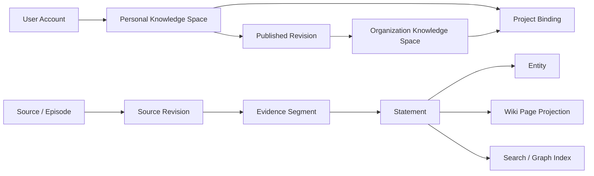
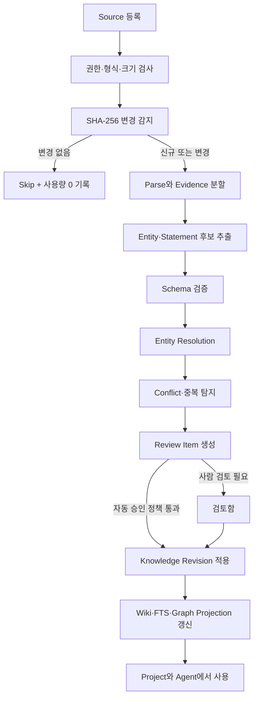
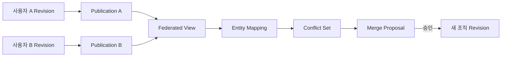

# Lumina Knowledge 시스템 설계

> 상태: 구현 전 설계 기준
>
> 작성일: 2026-07-18
>
> 적용 대상: 계정 단위 LLM-Wiki, Knowledge Graph, 검색, 검토, Project 연결과 조직 공유

## 1. 결론

Lumina에 `에이전트`, `Memory`, `마켓스토어`와 동급인 최상위 기능 **`지식`(`Knowledge`)** 을 추가합니다.

`Wiki`는 사용자가 읽고 편집하는 표현 형식이고 Knowledge Graph는 관계 탐색과 검색을 위한 구조입니다. 기능 전체를 `Wiki`나 `Graph`라고 부르면 원본, 출처, 검토, 공유와 검색을 포괄하지 못하므로 최상위 제품명과 내부 모듈명은 `Knowledge`로 통일합니다.

```text
지식 (Knowledge)
├─ 홈                 최근 변경, 처리 현황, 비용과 품질 경고
├─ 위키               사람이 읽는 페이지
├─ 탐색               검색, 질문, 관련 지식과 Context Pack
├─ 그래프             Entity와 Statement 관계 탐색
├─ 원본               파일, URL, 대화와 수동 입력
├─ 검토               신규 주장, 충돌, 병합과 게시 요청
└─ 설정               목적, 스키마, 모델, 비용과 공유 정책
```

핵심 결정은 다음과 같습니다.

1. **계정이 기본 소유 단위**입니다. 각 사용자는 기본 개인 Knowledge Space를 가집니다.
2. **Project와 Knowledge를 동일 객체로 만들지 않습니다.** 특정 Revision을 명시적으로 Project에 연결합니다.
3. **원본과 파생 지식을 분리합니다.** Source Revision이 원본 Episode 역할을 하고 Statement, Wiki Page, Graph와 검색 인덱스는 추적 가능한 파생물입니다.
4. **Statement를 지식의 정규 단위로 사용합니다.** 단순 edge가 아니라 출처, 시간, 신뢰도, 상태와 작성자를 가진 주장 객체입니다.
5. **SQLite로 개발을 시작하고 PostgreSQL로 운영 전환**합니다. 두 DB가 같은 SQLAlchemy 도메인 모델과 Alembic migration을 사용합니다.
6. Neo4j는 초기 의존성이 아닙니다. PostgreSQL의 실제 병목이 측정된 뒤 선택 가능한 파생 Graph Backend로만 검토합니다.
7. LLM은 운영 DB를 직접 수정하지 않습니다. 구조화된 변경 제안을 만들고 Validator와 권한 검사를 통과한 뒤 Backend가 적용합니다.
8. 개인 지식의 조직 공유는 원본 소유권 이전이 아니라 **고정된 Revision 게시**입니다.
9. 여러 사람의 지식은 곧바로 덮어써 합치지 않습니다. Federation View, Entity Mapping, Conflict와 Merge Proposal을 거쳐 새 조직 Revision을 만듭니다.
10. 비용은 사후 집계만 하지 않고 단계별 예산, 증분 처리, 캐시, 모델 등급과 성능 저하 모드로 선제 통제합니다.

## 2. 제품 범위와 기존 기능의 경계

### 2.1 Knowledge와 Memory

| 구분 | Memory | Knowledge |
|---|---|---|
| 목적 | 사용자 선호와 반복 작업 맥락 | 검증·탐색·공유 가능한 지식 자산 |
| 대표 내용 | “사용자는 Python을 선호함” | “정책 A는 2026-07-01부터 적용됨” |
| 기본 범위 | 사용자 또는 Project | 사용자 소유 Space, 게시된 조직 Space |
| 출처 요구 | 가능한 한 유지 | 필수. Statement마다 Evidence 필요 |
| 시간·충돌 | 단순 활성/대체 가능 | 유효기간, 상충 주장, Rank와 Review 필요 |
| 표현 | 짧은 기억 항목 | Source, Statement, Wiki, Graph, 검색 인덱스 |

Knowledge에서 검증된 사용자 선호를 Memory 반영 후보로 제안할 수는 있지만 자동 복사하지 않습니다. 반대로 Memory는 Knowledge 검색 결과에 자동 노출하지 않고 명시적 scope가 있을 때만 Context로 사용합니다.

### 2.2 Knowledge와 Project

Project는 파일·지침·Session·Run의 업무 격리 경계이고, Knowledge는 계정에 지속되는 지식 자산입니다.

```text
User Account
└─ Personal Knowledge Space
   ├─ Revision 12
   ├─ Revision 13
   └─ Revision 14
          │
          ├─ Project A Binding: revision 14, read
          └─ Project B Binding: revision 12, read
```

Project 연결은 다음을 고정합니다.

- `knowledge_space_id`
- `revision_id` 또는 명시적 `follow_latest_approved`
- 허용 namespace와 tag
- 사용 권한: `read`, `suggest`, `curate`
- 연결한 사용자와 시각
- Run에서 실제 사용한 Revision과 검색 설정 snapshot

기본값은 고정 Revision입니다. `follow_latest_approved`는 사용자가 명시적으로 선택한 경우에만 허용하며, 새 Revision이 Project에 영향을 주기 전에 변경 요약과 권한을 검증합니다.

### 2.3 Knowledge와 파일·Artifact

- 파일은 원본 Source가 될 수 있습니다.
- Wiki Page는 DB의 정규 지식으로부터 렌더링되는 편집 가능한 Projection입니다.
- 보고서·프레젠테이션 같은 Artifact는 Knowledge를 사용해 생성할 수 있지만 자동으로 Knowledge에 편입하지 않습니다.
- Artifact를 다시 Source로 추가하려면 사용자가 명시적으로 수집하고 순환 provenance를 탐지해야 합니다.

## 3. 참고 사례와 채택할 원칙

### 3.1 LLM-Wiki 프로젝트

| 프로젝트 | 참고할 점 | Lumina 적용 | 그대로 채택하지 않는 점 |
|---|---|---|---|
| [nashsu/llm_wiki](https://github.com/nashsu/llm_wiki) | Raw → Wiki → Schema, 증분 SHA-256, 지속 큐, Review, Graph, 출처 추적 | Source digest, 처리 큐, Wiki lint, 검토함, 그래프 UI | 파일 시스템을 권한·Revision의 원본으로 사용하지 않음 |
| [nvk/llm-wiki](https://github.com/nvk/llm-wiki) | Ingest → Compile → Audit → Query, 연구·계획 명령 체계 | Agent Tool과 작업 상태를 명시적으로 분리 | 명령 실행이 DB 계약을 우회하지 않게 함 |
| [NiharShrotri/llm-wiki](https://github.com/NiharShrotri/llm-wiki) | Obsidian 호환 Markdown, source summary, lint와 write-back | Markdown import/export, backlink, 저장 후보 | Markdown을 유일한 정규 저장소로 삼지 않음 |
| [atomicstrata/llm-wiki-compiler](https://github.com/atomicstrata/llm-wiki-compiler) | Claim-level provenance와 lint | Statement-Evidence 완전성 검사 | 컴파일 결과를 검토 없이 게시하지 않음 |
| [getzep/graphiti](https://github.com/getzep/graphiti) | Episode provenance, 시간에 따라 바뀌는 fact와 증분 통합 | Episode, `valid_from/to`, supersede 관계 | Neo4j 의존 구조와 권한 모델을 그대로 가져오지 않음 |

### 3.2 논문과 대규모 사례

- [Microsoft GraphRAG 논문](https://www.microsoft.com/en-us/research/publication/from-local-to-global-a-graph-rag-approach-to-query-focused-summarization/)은 대규모 문서 집합의 전역 질문에 community summary가 유용함을 보입니다. Lumina에서는 `Global` 검색을 항상 실행하지 않고 사용자가 전체 경향·주제·비교를 물을 때만 선택합니다. [공식 구현](https://github.com/microsoft/graphrag)도 indexing 비용이 클 수 있다고 경고하므로 초기 기본 경로로 사용하지 않습니다.
- [HippoRAG](https://arxiv.org/abs/2405.14831)는 Knowledge Graph와 Personalized PageRank를 결합한 연상 검색과 다중 hop 질의의 가능성을 보여줍니다. Lumina의 Graph traversal과 재순위화 후보로 삼되 MVP 필수 기능으로 두지 않습니다.
- [LightRAG](https://arxiv.org/abs/2410.05779)는 저수준 entity 관계와 고수준 주제를 함께 검색하고 증분 갱신하는 방향을 제시합니다. Lumina도 Local/Global 검색을 구분하고 Source 변경분만 재계산합니다.
- [KAG](https://github.com/OpenSPG/KAG)는 chunk와 knowledge의 상호 인덱싱, schema-constrained extraction, 논리·수치·텍스트를 조합한 검색을 강조합니다. Lumina는 Statement에서 Evidence chunk로, 답변 citation에서 원문으로 왕복할 수 있어야 합니다.
- [iText2KG](https://arxiv.org/abs/2409.03284)는 문서 정제, 증분 entity/relation 추출, graph integration을 별도 단계로 나눕니다. Lumina도 한 번의 LLM 호출로 추출과 병합을 동시에 확정하지 않습니다.
- [Wikidata 데이터 모델](https://www.wikidata.org/wiki/Help:Data_model)은 Statement에 qualifier, reference와 rank를 붙여 여러 시점과 상충 값을 함께 보존합니다. Lumina의 Statement 중심 모델이 단순 triple보다 우선하는 근거입니다.
- [W3C PROV-DM](https://www.w3.org/groups/wg/prov/publications/)의 Entity, Activity, Agent와 derivation 개념을 축약 적용하여 누가 어떤 원본과 모델로 무엇을 생성했는지 추적합니다.

연구 결과는 GraphRAG가 모든 질문에서 Vector RAG보다 낫다는 의미가 아닙니다. Lumina는 질의 유형과 평가 데이터에 따라 FTS, vector, graph, community summary를 선택하는 하이브리드 구조를 사용합니다.

## 4. 도메인 모델

### 4.1 전체 구조



### 4.2 주요 객체

#### KnowledgeSpace

지식의 소유·권한·정책 경계입니다.

```text
id
organization_id
owner_user_id nullable
space_type: personal | organization
name
description
purpose
default_language
ontology_mode: open | guided | strict
visibility: private | organization
current_approved_revision_id nullable
settings_revision
archived_at nullable
created_at / updated_at
```

- 사용자 생성 Space는 기본 `personal/private`입니다.
- 조직 Space는 개인 Space를 공유 상태로 바꾼 것이 아니라 별도 소유 객체입니다.
- `organization_id`는 테넌트 격리용이며 곧바로 조직 전체 공개를 뜻하지 않습니다.

#### KnowledgeSource와 SourceRevision

```text
KnowledgeSource
├─ id, space_id, owner_user_id
├─ source_type: file | url | conversation | text | connector
├─ title, canonical_locator, status
├─ sensitivity, retention_policy
└─ latest_revision_id

SourceRevision
├─ id, source_id, revision_number
├─ content_digest, media_type, byte_size
├─ storage_reference 또는 captured_text
├─ parser_name, parser_version, parse_digest
├─ captured_at, created_by_user_id
└─ supersedes_revision_id nullable
```

원본 파일은 기존 서버 Storage에 저장하고 DB에는 검증된 reference와 digest를 둡니다. URL은 주소만 저장하지 않고 수집 시점의 내용 digest, 제목, 시각과 허용되는 경우 원문 snapshot을 보관합니다.

#### EvidenceSegment

Statement가 근거로 가리키는 최소 검증 단위입니다.

```text
id
source_revision_id
segment_ordinal
locator_json             # page, paragraph, heading, timestamp 등
text
text_digest
language
token_count
```

Chunk는 모델 편의를 위한 임시 분할이고 Evidence는 사용자가 다시 찾아갈 수 있는 안정된 인용 단위입니다. chunking 알고리즘이 바뀌어도 기존 Statement의 Evidence locator가 무효화되지 않게 합니다.

#### Entity와 EntityAlias

```text
KnowledgeEntity
├─ id, space_id
├─ entity_type
├─ canonical_name
├─ normalized_key
├─ description
├─ status: active | merged | archived
└─ merged_into_entity_id nullable

KnowledgeEntityAlias
├─ entity_id
├─ alias
├─ normalized_alias
├─ language
└─ source: manual | extracted | imported
```

`normalized_name`만 같다고 자동 병합하지 않습니다. 같은 이름의 다른 대상과 다른 이름의 같은 대상을 모두 처리해야 하므로 alias, type, 주변 관계와 사람 검토를 사용합니다.

#### Statement

Statement는 지식의 가장 중요한 정규 객체입니다.

```text
id
space_id
subject_entity_id
predicate_key
object_kind: entity | text | number | date | boolean | json
object_entity_id nullable
object_value_json nullable
status: draft | proposed | approved | disputed | deprecated | rejected
rank: preferred | normal | deprecated
confidence nullable
valid_from nullable
valid_to nullable
recorded_at
created_by_type: user | agent | import
created_by_user_id nullable
created_by_run_id nullable
supersedes_statement_id nullable
revision_id
```

부가 조건은 `KnowledgeStatementQualifier`, 근거는 `KnowledgeStatementEvidence` 연결 테이블로 분리합니다. Statement 하나에 여러 Evidence가 붙을 수 있고 Evidence 하나가 여러 Statement를 뒷받침할 수 있습니다.

Statement의 `confidence`는 진실 확률로 단정하지 않습니다. 추출기의 확신, 출처 등급, 검토 상태와 최신성을 별도 신호로 보존하고 UI에서 하나의 점수로 오해되지 않게 표시합니다.

#### WikiPage와 WikiPageRevision

Wiki Page는 Statement를 사람이 읽기 좋은 서술로 구성한 Projection이지만 사용자의 수동 편집도 보존합니다.

```text
WikiPage
├─ id, space_id, slug, title, page_type
├─ current_revision_id
└─ status

WikiPageRevision
├─ id, page_id, revision_number
├─ markdown_body
├─ generated_sections_json
├─ manual_sections_json
├─ source_statement_revision_id
├─ generation_run_id nullable
└─ created_by_user_id / created_at
```

재생성 시 사용자가 편집한 문단을 덮어쓰지 않습니다. 생성 영역과 수동 영역을 구분하거나 section-level patch를 사용합니다. Markdown 내보내기는 지원하지만 DB Revision이 서버 원본입니다.

#### Revision, Publication과 Merge

```text
KnowledgeRevision
├─ id, space_id, revision_number
├─ parent_revision_id nullable
├─ status: draft | review | approved | published | superseded
├─ content_digest
├─ change_summary
└─ created_by / approved_by / timestamps

KnowledgePublication
├─ id
├─ source_space_id, source_revision_id
├─ target_organization_space_id
├─ permission: view | suggest
├─ status: requested | published | revoked
└─ published_by / published_at / revoked_at

KnowledgeMergeProposal
├─ id, target_space_id
├─ source_publication_ids
├─ entity_mapping_set_id
├─ proposed_statement_changes
├─ conflict_summary
├─ status: draft | review | accepted | rejected
└─ proposer / reviewer / timestamps
```

게시 후 원본 개인 Space가 변경되어도 게시 Revision은 바뀌지 않습니다. 원 게시자가 공유를 철회할 때 조직이 이미 인용·파생한 결과를 삭제할지 snapshot으로 보존할지는 조직 보존 정책으로 정하며, UI에서 게시 전에 명확히 알립니다.

### 4.3 최소 테이블 집합

MVP의 최소 테이블은 다음과 같습니다.

```text
knowledge_spaces
knowledge_sources
knowledge_source_revisions
knowledge_evidence_segments
knowledge_entities
knowledge_entity_aliases
knowledge_statements
knowledge_statement_qualifiers
knowledge_statement_evidence
knowledge_revisions
knowledge_revision_members
knowledge_pages
knowledge_page_revisions
knowledge_project_bindings
knowledge_ingestion_jobs
knowledge_review_items
knowledge_usage_events
```

조직 공유 단계에서 다음을 추가합니다.

```text
knowledge_publications
knowledge_publication_grants
knowledge_entity_mappings
knowledge_merge_proposals
knowledge_merge_conflicts
```

## 5. 수집·컴파일·검토 파이프라인



### 5.1 작업 상태

```text
queued | parsing | extracting | resolving | reviewing |
applying | indexing | completed | partial | failed | cancelled
```

- 파일 단위와 segment 단위 checkpoint를 저장합니다.
- 재시도 시 완료된 parse와 embedding을 재사용합니다.
- 동일 `source_revision_id + pipeline_version` 작업은 idempotency key로 중복 실행하지 않습니다.
- `partial`은 일부 segment 실패와 성공 결과를 모두 보여주며 조용히 완료 처리하지 않습니다.
- 취소는 이미 승인된 Revision을 되돌리지 않고 아직 적용하지 않은 후보만 중단합니다.

### 5.2 Agent 변경 계약

Agent가 반환하는 변경안은 자유 형식 Markdown이 아니라 구조화된 Patch입니다.

Codex를 포함한 Provider마다 별도 Knowledge 실행기를 만들지 않습니다. 기존 Lumina Agent Loop, Run snapshot, Queue, Provider Adapter와 Tool 권한을 재사용하고 `knowledge.*` Tool을 통해 읽기와 변경 제안을 수행합니다. 대량 ingest는 브라우저 연결과 분리된 지속 작업으로 실행하되, 원인을 추적할 수 있도록 시작한 사용자와 선택적으로 `run_id`를 기록합니다.

```json
{
  "base_revision_id": "...",
  "source_revision_ids": ["..."],
  "entity_upserts": [],
  "statement_proposals": [],
  "page_section_patches": [],
  "conflicts": [],
  "citations": [],
  "pipeline_version": "knowledge-extract-v1"
}
```

Backend는 다음 순서로 처리합니다.

1. 현재 사용자, 조직, Space와 Source 접근 권한 재검증
2. `base_revision_id`가 최신인지 CAS 검사
3. JSON Schema와 ontology 검증
4. 존재하지 않는 Source/Evidence ID 거부
5. Entity 중복과 충돌 후보 계산
6. 비용·개수·깊이 제한 검사
7. Review 또는 자동 승인 정책 결정
8. 하나의 DB transaction으로 Revision 적용
9. Audit와 usage event 기록

Agent와 외부 Skill에는 처음부터 읽기와 쓰기 권한을 분리합니다.

```text
knowledge.search          read
knowledge.get             read
knowledge.context_pack    read
knowledge.propose         suggest
knowledge.review          curate
knowledge.publish         publish
knowledge.admin           admin
```

### 5.3 완료된 리서치 Run 자동 축적

계정에는 자동 축적 대상 Personal Knowledge Space를 최대 하나만 둡니다. 첫 개인 Space를 만들면 기본 대상으로 설정하며 사용자는 `설정` 화면에서 대상을 현재 Space로 전환하거나 전체 자동 축적을 끌 수 있습니다.

자동 축적은 모든 대화를 무조건 저장하지 않습니다. `web_fetch`로 원문을 실제 확인했고 `fetched_content + complete` provenance가 남은 완료 Run만 다음 순서로 처리합니다.

1. Run 완료 transaction을 먼저 확정합니다. Knowledge 저장 실패는 원래 답변 완료를 되돌리지 않습니다.
2. 별도 transaction에서 assistant 분석문, conversation/run/message locator와 확인된 웹 출처 excerpt를 `conversation` Source Revision으로 보존합니다.
3. 같은 captured content는 SHA-256 digest로 재사용합니다.
4. AI extraction 입력은 최대 60,000자로 제한하고 계정의 기본 실행 모델 snapshot으로 ingestion job을 생성합니다.
5. 추출 Statement는 자동 승인하지 않고 `proposed` 상태로 검토함에 둡니다.
6. process가 job enqueue 전에 종료되어도 DB의 `queued` 상태를 startup recovery가 다시 실행합니다.

검색 snippet만 있거나 자동 축적이 꺼진 경우에는 Source와 ingestion job을 만들지 않습니다. Source 저장에 성공했지만 Provider를 사용할 수 없으면 원문은 보존하고 추출만 보류합니다.

## 6. 검색과 답변 생성

### 6.1 검색 모드

| 모드 | 용도 | 초기 구현 |
|---|---|---|
| Keyword | 정확한 명칭, 정책 번호, 문구 | SQLite FTS5 / PostgreSQL FTS |
| Semantic | 표현이 다른 유사 개념 | MVP 후 선택적 embedding |
| Graph Local | 특정 Entity 주변 1~3 hop | recursive CTE |
| Graph Global | 전체 주제와 community 요약 | 후속 실험, opt-in |
| Hybrid | Keyword + Semantic + Graph 재순위화 | 단계적 도입 |

질문 분류기는 비싼 LLM 호출보다 먼저 규칙과 경량 모델을 사용합니다.

```text
정확한 명칭·인용 요청        → Keyword 우선
의미가 비슷한 문서 찾기       → Semantic 우선
누가/무엇과 연결되는가        → Graph Local
전체 경향·핵심 주제·비교      → Graph Global 후보
불명확하거나 복합 질문         → Hybrid
```

### 6.2 검색 결과 계약

답변 생성기에 전달하는 각 항목은 다음을 포함합니다.

```text
statement_id
statement_revision_id
subject / predicate / object
qualifiers
rank / status
evidence_segment_id
source_title / locator
valid_from / valid_to
space_id / publication_id
retrieval_method / score
```

최종 답변의 citation은 Wiki Page만 가리키지 않고 Evidence까지 열 수 있어야 합니다. 게시된 지식을 사용한 경우 게시 Revision과 원본 공개 범위를 표시하되 접근 권한이 없는 원본 내용과 소유자의 다른 데이터는 노출하지 않습니다.

### 6.3 Context Pack

Agent에는 전체 Wiki를 넣지 않고 목적에 맞는 Context Pack을 제공합니다.

```text
Context Pack
├─ 질문과 적용된 scope
├─ 핵심 Statement
├─ 관련 Entity와 제한된 neighborhood
├─ Evidence excerpt와 citation
├─ 알려진 Conflict와 불확실성
├─ 적용된 Knowledge Revision
└─ token budget과 생략 요약
```

Run snapshot에는 Pack 내용의 digest, Statement Revision ID, 검색 설정과 생성 시각을 저장하여 같은 결과를 설명하고 재현할 수 있게 합니다.

## 7. 계정, 조직 공유와 여러 사람의 지식 결합

### 7.1 기본 권한

| 대상 | 기본 권한 |
|---|---|
| 개인 Knowledge Space 소유자 | 읽기·편집·검토·게시 |
| 같은 조직의 일반 사용자 | 없음 |
| 연결된 Project 구성원 | Binding에 허용된 읽기 또는 제안 |
| 조직 Knowledge Space curator | 검토·병합·게시 |
| 관리자 | 운영·감사 권한, 모든 변경 감사 |

Frontend가 보낸 `space_id`, `project_id`, `revision_id`, role을 신뢰하지 않습니다. 모든 query와 mutation에서 Backend가 인증 principal, ownership, membership, publication grant와 Project binding을 다시 확인합니다.

### 7.2 공유 방식

공유는 다음 세 종류를 구분합니다.

1. **Project Binding**: 특정 Project에서 특정 Revision을 사용합니다.
2. **Direct Grant**: 특정 사용자에게 Space 또는 Revision 읽기 권한을 줍니다.
3. **Organization Publication**: 개인 지식의 승인 Revision을 조직 지식 후보로 게시합니다.

공유 링크를 지원한다면 대화 공유와 같은 원칙을 적용합니다. 원본 token은 한 번만 반환하고 DB에는 hash만 저장하며, 링크는 고정 Revision의 읽기 전용 snapshot을 기본으로 합니다.

### 7.3 결합 절차

여러 사람의 지식은 아래처럼 결합합니다.



1. 게시 Revision들을 읽기 전용 Federation View로 함께 보여줍니다.
2. alias, type, external ID와 관계 문맥으로 Entity mapping 후보를 만듭니다.
3. 자동 확정 threshold를 넘지 못한 mapping은 검토함으로 보냅니다.
4. 동일 subject/predicate에서 object, 유효기간 또는 qualifier가 다르면 Conflict로 유지합니다.
5. curator가 선택·병합·병존·폐기를 결정합니다.
6. 결정 결과는 새 조직 Revision이며 출처 Publication과 Evidence를 계속 가리킵니다.

충돌은 데이터 오류만 뜻하지 않습니다. 서로 다른 시점, 지역, 가정이나 출처의 정당한 차이일 수 있으므로 qualifier를 먼저 비교하고 무조건 한쪽을 제거하지 않습니다.

## 8. 저장소 전략

### 8.1 현재 개발: SQLite

SQLite는 초기 구현에 충분합니다.

- Entity, Statement, Evidence와 Revision은 일반 관계형 테이블로 저장합니다.
- [recursive CTE](https://www.sqlite.org/lang_with.html)로 제한된 깊이의 graph traversal을 구현합니다.
- [FTS5](https://www.sqlite.org/fts5.html)로 Source, Wiki Page와 Statement text를 검색합니다.
- 현재 Lumina의 `PRAGMA foreign_keys=ON`, WAL, busy timeout 설정을 그대로 사용합니다.
- WAL은 reader와 writer의 상호 차단을 줄이지만 writer는 사실상 직렬화되므로 추출 worker 수를 제한하고 transaction을 짧게 유지합니다.

SQLite MVP 제약은 다음과 같습니다.

- 한 프로세스의 단일 Knowledge apply worker를 기본으로 합니다.
- LLM 호출 중 DB transaction을 열어 두지 않습니다.
- 후보 추출은 transaction 밖에서 수행하고 짧은 CAS transaction으로 적용합니다.
- 그래프 탐색 기본 깊이는 3, node/edge 결과 상한을 둡니다.
- FTS5가 없는 빌드는 startup diagnostics에서 감지하고 LIKE fallback이 아니라 기능 비활성 상태를 명확히 표시합니다.
- 대규모 vector를 JSON으로 저장해 SQL에서 거리 계산하지 않습니다.

### 8.2 운영 전환: PostgreSQL

PostgreSQL에서도 같은 정규 테이블과 서비스 계약을 사용합니다.

- 다중 worker와 동시 쓰기
- Row-Level Security를 방어 계층으로 추가
- PostgreSQL Full Text Search
- advisory lock 또는 `FOR UPDATE SKIP LOCKED` 기반 job claim
- 파티셔닝과 대규모 index
- 선택적 [pgvector](https://github.com/pgvector/pgvector)의 exact, HNSW 또는 IVFFlat 검색

RLS는 Backend 권한 검사를 대체하지 않고 실수에 대한 추가 방어입니다. connection pool의 사용자 context 누수와 migration 계정 우회를 테스트해야 합니다.

### 8.3 SQLite와 PostgreSQL 이식 규칙

- ID는 현재 Lumina 관례와 같은 문자열 UUID를 사용합니다.
- 배열 대신 연결 테이블을 사용합니다.
- JSON은 qualifier metadata처럼 유연성이 필요한 값에만 사용하고 ownership, status, revision과 검색 필드는 정규 컬럼으로 둡니다.
- SQLite의 느슨한 type coercion, rowid와 `INSERT OR REPLACE`에 의존하지 않습니다.
- boolean partial index는 SQLite와 PostgreSQL 조건을 각각 명시합니다.
- UTC timezone-aware timestamp를 사용합니다.
- 모든 schema 변경은 Alembic migration으로 수행합니다.
- SQLAlchemy metadata의 PostgreSQL compile test와 선택적 live PostgreSQL smoke test를 추가합니다.

### 8.4 Neo4j 도입 조건

Neo4j는 다음 조건이 측정으로 확인될 때만 추가합니다.

- 수백만 이상 edge에서 가변 깊이 탐색이 제품 핵심인데 PostgreSQL이 목표 지연시간을 충족하지 못함
- community detection, 중심성, PageRank를 반복적으로 제공해야 함
- 사용자에게 자유로운 Cypher 분석을 안전한 별도 환경에서 제공해야 함
- PostgreSQL 쿼리·인덱스 개선 후에도 graph workload가 주 병목임

도입하더라도 PostgreSQL이 권한·Revision·Evidence의 원본이고 Neo4j는 outbox로 갱신하며 재구축 가능한 Projection이어야 합니다. 요청 처리 중 두 DB에 직접 dual write하지 않습니다.

## 9. 비용 증가에 따른 절감 정책

### 9.1 비용 측정 단위

모든 ingest/query 작업은 다음 사용량을 단계별로 기록합니다.

```text
parse_cpu_ms
source_bytes
segments_total / changed
embedding_tokens
extraction_input_tokens / output_tokens
resolution_input_tokens / output_tokens
summary_input_tokens / output_tokens
query_input_tokens / output_tokens
provider / model / price_revision
estimated_cost / billed_cost nullable
cache_hits / cache_misses
```

집계 scope는 `user`, `organization`, `knowledge_space`, `project`, `job`, `run`입니다. 가격표가 바뀌더라도 당시 계산을 재현할 수 있도록 `price_revision`을 함께 저장합니다.

### 9.2 기본 절감 순서

1. **변경 감지**: Source와 segment SHA-256이 같으면 parse 이후 LLM·embedding 단계를 생략합니다.
2. **단계별 캐시**: `content_digest + pipeline_version + model_id + prompt_digest`를 cache key로 사용합니다.
3. **증분 적용**: 바뀐 segment와 영향을 받는 Entity/Page만 다시 계산합니다.
4. **구조화 추출 1회 재사용**: Wiki, Graph와 검색 인덱스가 같은 Statement 후보를 사용합니다.
5. **모델 계층화**: 분류·정규화·간단 추출은 저비용 모델, 충돌 판정과 복합 synthesis만 상위 모델을 사용합니다.
6. **후보 제한**: deterministic lookup과 lexical 후보 축소 후 LLM entity resolution을 호출합니다.
7. **Batch와 token packing**: 작은 segment는 출처 경계를 보존한 채 묶고 큰 문서는 계층적으로 처리합니다.
8. **Global summary opt-in**: community 생성과 전체 재요약은 매 ingest마다 실행하지 않습니다.
9. **검색 예산**: 기본 top-k, hop, rerank 후보와 Context Pack token을 제한합니다.
10. **저장 수명주기**: 실패한 임시 후보와 오래된 cache는 보존 정책에 따라 정리하되 승인 Revision과 Evidence는 임의 삭제하지 않습니다.

### 9.3 예산 정책

```text
KnowledgeBudgetPolicy
├─ monthly_soft_limit
├─ monthly_hard_limit
├─ per_ingest_limit
├─ per_query_limit
├─ max_source_bytes
├─ max_segments_per_job
├─ max_graph_hops
├─ max_context_tokens
├─ allowed_model_tiers
└─ overage_behavior
```

한도 동작은 다음과 같이 고정합니다.

| 상태 | 동작 |
|---|---|
| 70% | UI에 예상 소진 시점과 상위 비용 작업 표시 |
| Soft limit | Global summary·Deep Research·고급 rerank를 사용자 확인 뒤 실행 |
| Hard limit | 새 유료 작업 중단, 이미 승인된 데이터의 읽기·FTS·graph 탐색은 유지 |
| Provider 장애/가격 미상 | 비용을 0으로 간주하지 않고 `unknown`으로 표시하고 조직 정책에 따라 차단 |

저비용 모드는 품질을 조용히 낮추지 않습니다. 어떤 단계를 생략했는지 결과에 표시하고 사용자가 전체 품질 재처리를 예약할 수 있게 합니다.

### 9.4 비용 급증 방지

- 동일 파일·URL의 반복 업로드는 digest로 dedupe합니다.
- Source가 자기 파생 Wiki/Artifact를 다시 수집하는 순환을 차단합니다.
- retry는 같은 idempotency key와 최대 횟수를 사용합니다.
- prompt injection으로 “전체 Wiki 재구축” 같은 고비용 작업을 유도하지 못하게 Tool 권한과 job limit을 Backend에서 검사합니다.
- query-time graph traversal 결과가 폭발하지 않도록 depth, fan-out, total nodes와 timeout을 제한합니다.
- 조직 전체 rebuild와 embedding model 교체는 예상 비용·대상 수·중단 가능성을 보여주고 별도 승인합니다.

## 10. UI 계약

### 10.1 Navigation

- 최상위 sidebar label은 **`지식`** 으로 사용합니다.
- 영문 locale과 내부 route는 `Knowledge`, `/knowledge`를 사용합니다.
- `LLM-Wiki`, `Knowledge Graph`는 하위 기능 설명에만 사용합니다.
- 아이콘은 책 한 권보다 node와 문서를 함께 연상시키되 기존 `Memory` 뇌 아이콘과 혼동하지 않게 합니다.
- 선택·hover·focus는 `DESIGN.md`의 Navigation token을 사용합니다.

### 10.2 기본 화면

```text
Left: Knowledge navigation / Space selector / tree
Center: Wiki, Search result, Review list 또는 Graph canvas
Right: Source, Evidence, Statement detail과 Revision diff
```

Space selector는 다음 scope를 명확히 구분합니다.

- 내 지식
- 나에게 공유됨
- 조직 지식
- 현재 Project에서 사용 중

색만으로 구분하지 않고 owner, Revision, 공유 범위와 권한 label을 표시합니다.

### 10.3 주요 상호작용

- Source 추가 전 예상 파일 수, 처리 단계와 비용 범위를 표시합니다.
- 처리 중에는 파일별 상태, 완료/실패/재시도와 취소를 보여줍니다.
- Wiki 문장에서 citation을 누르면 오른쪽 Evidence가 정확한 page·문단·시각으로 열립니다.
- Entity를 누르면 alias, type, 주변 Statement, 충돌과 source coverage를 보여줍니다.
- Graph는 전체를 한 번에 그리지 않고 선택 Entity 중심 neighborhood를 점진적으로 확장합니다.
- 자동 추출 결과는 `제안됨`, 사람 승인 결과는 `승인됨`, 상충 내용은 `충돌`로 표시합니다.
- 이름·제목은 보이는 자리에서 직접 편집하고 저장·취소·오류를 같은 위치에 표시합니다.
- 삭제는 Lumina 공통 규칙대로 같은 버튼의 인라인 2단계 확인을 사용합니다.

## 11. Backend 모듈 경계와 API 초안

권장 패키지 경계입니다.

```text
apps/server/src/lumina/knowledge/
├─ schemas.py
├─ permissions.py
├─ spaces.py
├─ sources.py
├─ extraction.py
├─ resolution.py
├─ statements.py
├─ revisions.py
├─ publications.py
├─ retrieval.py
├─ costs.py
├─ jobs.py
└─ graph/
   ├─ base.py
   ├─ relational.py
   └─ neo4j.py              # 도입 결정 전 생성하지 않음
```

API 초안은 다음과 같습니다.

```text
GET    /api/knowledge/spaces
POST   /api/knowledge/spaces
GET    /api/knowledge/spaces/{space_id}
PATCH  /api/knowledge/spaces/{space_id}
GET    /api/knowledge/auto-capture
PATCH  /api/knowledge/auto-capture

POST   /api/knowledge/spaces/{space_id}/sources
GET    /api/knowledge/spaces/{space_id}/sources
POST   /api/knowledge/sources/{source_id}/ingestions
GET    /api/knowledge/ingestions/{job_id}
POST   /api/knowledge/ingestions/{job_id}/cancel

GET    /api/knowledge/spaces/{space_id}/pages
GET    /api/knowledge/pages/{page_id}
PATCH  /api/knowledge/pages/{page_id}

POST   /api/knowledge/search
POST   /api/knowledge/context-packs
GET    /api/knowledge/entities/{entity_id}/neighborhood

GET    /api/knowledge/spaces/{space_id}/reviews
POST   /api/knowledge/reviews/{review_id}/decision

POST   /api/knowledge/spaces/{space_id}/project-bindings
POST   /api/knowledge/revisions/{revision_id}/publications
POST   /api/knowledge/merge-proposals
```

List API는 cursor pagination을 사용하고 모든 응답에서 접근 가능한 최소 metadata만 반환합니다. Graph API는 `max_depth`, `max_nodes`, `max_edges`의 서버 상한을 무시할 수 없게 합니다.

## 12. 보안, 품질과 감사

### 12.1 보안

- Source text와 embedding은 사용자 데이터이며 Provider 전송 전에 조직 정책과 데이터 등급을 검사합니다.
- 민감도상 외부 Provider에 보낼 수 없는 Source는 로컬/사내 Provider 또는 수동 작성만 허용합니다.
- HTML, PDF와 Office parse는 비신뢰 입력으로 취급하고 실행 가능한 콘텐츠를 격리합니다.
- URL 수집은 SSRF 방지, redirect 제한, 허용 scheme, 사설 주소 정책과 최대 크기를 적용합니다.
- Source의 prompt injection은 데이터이지 시스템 지시가 아닙니다. 추출 prompt와 Tool 권한을 변경하지 못합니다.
- 검색 결과 cache key에 user, organization, Space, Revision과 permission projection을 포함합니다.
- 공유 철회와 membership 변경 시 관련 cache와 Context Pack을 무효화합니다.
- Secret, 원문 token, 인증서와 공유 token을 Run event나 usage log에 기록하지 않습니다.

### 12.2 품질 지표

```text
source_coverage              근거가 추출된 Source 비율
statement_evidence_coverage  Evidence가 있는 Statement 비율
orphan_entity_rate           연결되지 않은 Entity 비율
duplicate_entity_rate        중복 판정 표본 비율
conflict_review_age          미해결 충돌 체류 시간
citation_validity_rate       citation이 실제 locator로 열리는 비율
retrieval_recall@k           평가 질문 정답 근거 회수율
answer_groundedness          답변이 제공 Evidence로 지지되는 비율
sync_lag                     승인 Revision과 Projection 차이
cost_per_changed_source      변경 Source당 처리 비용
```

LLM-as-judge 하나만 품질 기준으로 사용하지 않습니다. 고정 평가 질문, 사람이 검토한 Statement/Evidence 표본, 검색 회수율과 citation 유효성을 함께 측정합니다.

### 12.3 감사 이벤트

다음 작업은 `audit_events` 또는 Knowledge 전용 세부 이벤트에 기록합니다.

- Space 생성·보관·삭제
- Source 등록·재수집·삭제
- Statement 승인·거절·폐기·복원
- Entity 병합·분리
- Project binding 생성·변경·해제
- 공유·게시·철회
- Merge Proposal 결정
- 관리자 조회·강제 변경
- 조직 전체 rebuild와 model/pipeline 교체

## 13. 단계별 구현 계획

### Phase 0 — Spike와 계약 검증

- SQLite/PostgreSQL 공통 SQLAlchemy 모델 초안
- 1~3 hop recursive CTE benchmark
- FTS5 availability diagnostics
- 구조화된 extraction Patch와 Validator
- 20~50개 문서의 수동 gold set 작성

완료 기준:

- Entity/Statement/Evidence round-trip이 두 dialect에서 compile됨
- 같은 Source를 두 번 수집할 때 두 번째 LLM 호출이 발생하지 않음
- 모든 Statement가 유효한 Evidence locator로 이동함

### Phase 1 — 개인 Knowledge MVP

- 최상위 `지식` navigation과 개인 기본 Space
- PDF/Markdown/Text/기존 Project File 수집
- Source Revision, Evidence, Entity, Statement와 Review
- Wiki Page 생성·수동 편집·Revision diff
- FTS 검색과 1~3 hop graph 탐색
- Project의 고정 Knowledge Revision 연결
- 단계별 usage/cost 집계와 soft/hard limit

완료 기준:

- 사용자가 원본을 추가하고 검토한 뒤 Wiki와 Graph에서 같은 지식을 확인할 수 있음
- 답변 citation이 원문 Evidence까지 연결됨
- 다른 사용자 계정에서는 ID를 알아도 접근할 수 없음
- SQLite에서 재시작 후 job과 Revision이 복원됨

### Phase 2 — 조직 공유와 결합

- Direct Grant와 Organization Publication
- Federation View
- Entity Mapping Review
- Conflict Set과 Merge Proposal
- 조직 curator role과 감사
- 공유 철회·보존 정책

완료 기준:

- 개인 원본을 변경해도 게시 Revision이 변하지 않음
- 두 사용자의 동명 Entity를 자동으로 잘못 합치지 않음
- 충돌 Statement가 출처와 qualifier를 잃지 않고 병존함
- 승인된 Merge가 새 조직 Revision으로 재현됨

### Phase 3 — PostgreSQL과 하이브리드 검색

- live PostgreSQL migration과 부하 검증
- worker job claim과 동시 처리
- RLS 방어 계층
- pgvector embedding과 hybrid retrieval
- 검색 평가 dashboard와 model/pipeline version 전환

### Phase 4 — 고급 GraphRAG 실험

- Local/Global query router
- PageRank 또는 community summary 실험
- PostgreSQL과 선택적 Neo4j 비교 benchmark
- latency, recall, groundedness, rebuild time, 운영 비용 기준으로 채택 여부 결정

Neo4j를 도입하지 않아도 Phase 1~3은 완성 가능한 제품 범위입니다.

## 14. 테스트 전략

### 14.1 Backend

- Space ownership과 조직 격리
- Source digest idempotency
- Evidence locator와 삭제 제약
- Statement object type과 qualifier validation
- Revision CAS 충돌
- Project binding 권한과 Run snapshot
- Publication snapshot 불변성
- Entity merge/split과 provenance 보존
- 비용 한도·retry·cache hit
- SQLite recursive CTE depth/cycle 제한
- PostgreSQL metadata compile과 선택적 live smoke

### 14.2 Frontend

- Space scope와 권한 label
- 수집 상태·partial failure·retry
- citation에서 Evidence 열기
- Graph node 확장 상한과 loading
- Review approve/reject/conflict
- 인라인 rename과 인라인 2단계 삭제
- 비용 soft/hard limit 상태
- 공유 철회 후 cache data 비노출

### 14.3 보안 회귀

- 다른 사용자 `space_id`, `source_id`, `statement_id` 직접 요청
- Project 구성원 제거 직후 접근
- 게시되지 않은 개인 Evidence deep link
- Graph traversal을 통한 비공개 node 존재 추론
- Source 내 prompt injection
- URL ingestion SSRF
- 악성 Office/PDF와 oversized archive
- cache key와 pagination cursor의 사용자 간 재사용

## 15. 초기 구현에서 하지 않을 것

- Neo4j 필수 설치
- 완전한 OWL/RDF/SPARQL ontology editor
- 모든 수집 결과의 무검토 자동 게시
- 사용자별 Knowledge를 물리적으로 복사한 뒤 동기화
- 전체 Wiki를 매 질문 prompt에 삽입
- 모든 Source 변경 시 전체 graph와 community 재생성
- LLM이 직접 SQL 또는 DB migration 실행
- confidence 하나로 진실 여부 자동 판정
- Project Memory와 Knowledge의 자동 상호 복제
- 접근 권한이 다른 그래프를 하나의 무필터 cache로 공유

## 16. 구현 착수 시 첫 작업 단위

첫 구현 PR은 UI 전체보다 도메인 불변 조건을 먼저 고정합니다.

1. `KnowledgeSpace`, `KnowledgeSource`, `SourceRevision`, `EvidenceSegment`, `Entity`, `Statement`, `StatementEvidence`, `KnowledgeRevision` 모델과 migration
2. SQLite/PostgreSQL 공통 constraint와 index
3. Space 권한 서비스
4. Source digest 등록과 중복 방지
5. 수동 Statement 생성·조회 API
6. Evidence가 없는 Statement 승인 금지
7. 제한된 recursive CTE neighborhood API
8. Backend 테스트와 PostgreSQL dialect compile test

그 다음 PR에서 ingestion job과 LLM Patch를 추가하고, 세 번째 PR에서 `지식` UI와 Wiki Projection을 연결하는 순서를 권장합니다. 이 순서라면 UI 시연을 위해 권한·출처·Revision 계약을 임시로 우회하지 않아도 됩니다.

## 17. 최종 의사결정 요약

| 항목 | 결정 |
|---|---|
| 최상위 이름 | `지식` / `Knowledge` |
| 기본 소유 | 사용자 계정의 개인 Knowledge Space |
| 조직 공유 | 고정 Revision Publication |
| Project 연동 | 명시적 Revision Binding |
| 지식 정규 단위 | Evidence를 가진 Statement |
| Wiki | 사람이 읽고 편집하는 Projection |
| Graph | Entity·Statement 관계 Projection과 검색 수단 |
| 개발 DB | SQLite |
| 운영 DB | PostgreSQL |
| Vector | 초기 선택 사항, 운영에서 pgvector 우선 검토 |
| Neo4j | 측정 후 선택 가능한 파생 backend |
| Agent 쓰기 | 구조화 Proposal → Validate → Review/Apply |
| 다중 사용자 결합 | Federation → Entity Mapping → Conflict → Merge Revision |
| 비용 통제 | digest, 증분 처리, 단계 캐시, 모델 계층, budget과 degrade mode |

이 설계의 중심은 “LLM이 문서를 예쁘게 요약하는 Wiki”가 아니라 **원본으로 되돌아갈 수 있고, 사람별 지식을 안전하게 공유·결합하며, Wiki와 Graph를 같은 Statement에서 일관되게 만드는 계정 단위 Knowledge 시스템**입니다.
