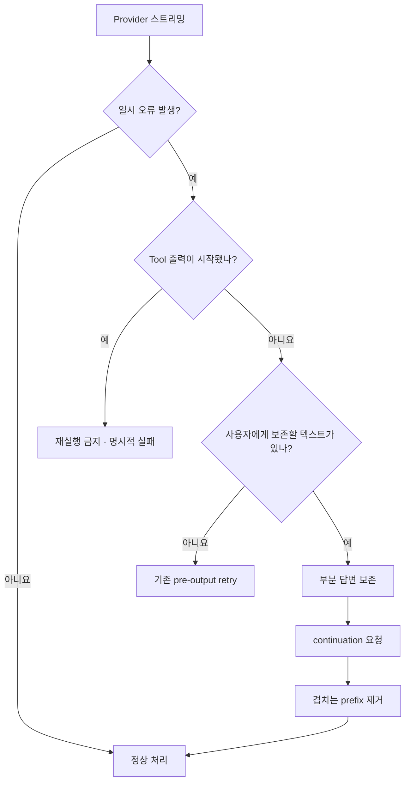

# Lumina AI Agent 신뢰성·컨텍스트 관리 심층 분석 보고서

- 작성일: 2026-07-15
- 비교 기준: `.examples/hermes-agent`, `.examples/MyHarness`
- 분석 대상: Lumina Agent 실행 루프, Provider 오류 복구, 컨텍스트 예산·압축, Run event
- 결론 수준: 소스 비교 + 로컬 Run DB 이력 분석 + 자동 회귀 테스트

## 1. 경영 요약

Lumina의 모델별 선언 컨텍스트 한도는 기준 구현과 일치한다. P-GPT `gpt-5.4`는 1,050,000 tokens, `gpt-5.4-mini`는 400,000 tokens이고, Codex 계열은 272,000 tokens와 85% 압축 임계값을 사용한다. 따라서 문제의 핵심은 카탈로그 숫자 자체가 아니라 다음 세 실행 정책이었다.

1. Provider가 텍스트를 일부 전송한 뒤 일시 오류를 내면 Lumina는 재개를 시도하지 않고 Run을 실패시켰다.
2. HTTP `Retry-After`를 반영하지 않고 고정 1초·2초 지연으로 재시도했다.
3. Provider가 오류 응답으로 실제 컨텍스트 한도를 알려도 선언값을 현재 Run에 보정하지 않았다.

이번 수정으로 세 경로를 모두 보강했다. Tool Call이 전혀 시작되지 않은 순수 텍스트 스트림에 한해 이미 받은 답변을 보존하고 자동으로 이어 쓰며, 재개 응답이 앞부분을 반복해도 최대 4,000자 범위에서 중복을 제거한다. `Retry-After`는 최대 600초까지 존중하며, 실제 컨텍스트 한도는 선언값보다 작을 때만 현재 Run에 적용한다. 오류 본문은 사용자 오류·로그·event에 노출하지 않는다.

이 수정은 확인된 P0 신뢰성 결함을 해결하며, 해당 영역에서는 MyHarness 수준의 복구 동작을 충족한다. 다만 “Hermes와 동급인 전체 Agent 성능”은 정적 소스 비교만으로 보장할 수 없다. Hermes의 실제 사용량 기반 토큰 추정 보정, 더 세분화된 오류 분류, 장시간 fault-injection benchmark는 후속 P1 과제로 남는다.

## 2. 분석 범위와 방법

다음 근거를 교차 검증했다.

- Lumina 제품·실행 계약: `README.md`, `docs/project-context/AGENT_LOOP.md`, `docs/project-context/HERMES_USER_FEATURES.md`, `docs/LUMINA_DETAILED_DESIGN.md`
- Lumina 구현: `apps/server/src/lumina/agent/executor.py`, `apps/server/src/lumina/context/service.py`, `apps/server/src/lumina/providers/`
- Hermes 참고 구현: `.examples/hermes-agent/agent/context_compressor.py`, `.examples/hermes-agent/agent/conversation_loop.py`, `.examples/hermes-agent/agent/turn_retry_state.py`, `.examples/hermes-agent/agent/retry_utils.py`
- MyHarness 참고 구현: `.examples/MyHarness/src/myharness/engine/query.py`, `.examples/MyHarness/src/myharness/services/compact/__init__.py`, `.examples/MyHarness/src/myharness/api/openai_client.py`
- 로컬 SQLite의 Run status, error code, reliability event 집계
- Provider 오류·출력 재개·컨텍스트 압축 자동 테스트

`.examples/`는 참고 전용으로만 읽었으며 Lumina의 import, build, package 대상에는 포함하지 않았다.

## 3. 로컬 Run 이력에서 확인한 장애 특성

분석 시점의 로컬 개발 DB에는 terminal Run 70건이 있었다.

| 상태 | 건수 | 비고 |
|---|---:|---|
| completed | 43 | 정상 완료 |
| failed | 22 | 전체 이력의 31.4%, cancelled 제외 시 33.8% |
| cancelled | 5 | 사용자·운영 중단 포함 |

실패 22건의 error code는 다음과 같았다.

| 오류 계층 | 건수 | 실패 중 비율 |
|---|---:|---:|
| `provider_request` | 19 | 86.4% |
| `executor_error` | 3 | 13.6% |

민감한 원문을 출력하지 않고 분류했을 때, Provider 실패 중 확인 가능한 전송 종료 계열(`Transport closed`)이 최소 3건, 인증 문구 계열이 4건이었다. 나머지 15건은 현재 저장된 redacted 오류만으로 세부 원인을 확정할 수 없었다. `run_interrupted`와 `run_recovery_scheduled`는 각각 38건으로 worker 복구 자체는 작동했지만, 첫 텍스트 이후 Provider 스트림 오류는 worker 복구 대상이 아니라 실행 루프에서 곧바로 실패했다.

이 수치는 개발 이력 전체의 누적값이므로 운영 SLO로 해석하면 안 된다. 다만 실패의 대부분이 Provider 요청 계층에 집중되어 있어 이번 복구 경로가 최우선이라는 판단에는 충분한 근거가 된다.

## 4. Hermes·MyHarness 대비 분석

| 영역 | Hermes | MyHarness | 수정 전 Lumina | 수정 후 평가 |
|---|---|---|---|---|
| 출력 한도 자동 이어쓰기 | 구조화된 continuation | 최대 4회 continuation | 최대 4회 지원 | 동등, 중복 제거 강화 |
| 일부 텍스트 후 스트림 오류 | 분류별 재개 경로 | partial flow 유지 | 즉시 실패 | Tool 없는 텍스트에 한해 복구 |
| Tool Call 재실행 안전성 | 상태 기반 제한 | 실행 상태 보존 | 첫 출력 후 전체 재시도 금지 | Tool 출력은 계속 재시도 금지 |
| `Retry-After` | 반영, 상한 적용 | Provider retry 지원 | 고정 1초·2초 | 최대 600초 반영 |
| 선언 컨텍스트 한도 | 모델별 설정 | P-GPT 1.05M/400K | 동일 값 | 동일 |
| 실제 한도 오류 학습 | 오류에서 한도 추출 | reactive compaction | 분류만 하고 숫자 폐기 | 현재 Run을 lower-only 보정 |
| 선제·반응형 압축 | 사용량 보정 + 압축 | microcompact + 요약 | 둘 다 지원 | 유지 |
| Tool 결과 축소 | 도구별 output limit | microcompact | 도구별 bounded preview + microcompact | 유지 |
| Prompt cache 안정성 | 안정 prefix 중시 | cache key·optional fallback | 안정 prefix·cache key | 유지 |
| Provider failover | 폭넓은 fallback | 제한적 | 자동 교차 Provider 전환 없음 | 보안·데이터 경계상 의도적 |
| 토큰 추정 자기보정 | 실제 사용량으로 보정 | 제한적 | P-GPT 4/3 padding | Hermes 대비 P1 격차 |
| 오류 관측 세분화 | 분류가 풍부함 | 비교적 세분화 | redacted `provider_request` 집중 | 신규 recovery/context event 추가, P1 잔여 |

### 평가

- MyHarness 최소선: 이번에 다룬 출력 지속성, 반응형 컨텍스트 복구, Provider backoff 영역은 충족한다.
- Hermes 상한선: 안전한 Tool 실행 경계와 압축 구조는 근접했지만, 실제 token usage 기반 estimator calibration과 오류 taxonomy는 아직 부족하다.
- 자동 Provider failover는 단순 성능 격차로 보지 않는다. 회사 데이터가 다른 Provider로 이동할 수 있으므로 관리자 정책과 명시적 승인 없이 추가하면 안 된다.

## 5. 근본 원인

### 5.1 첫 출력 이후 재시도 차단이 지나치게 넓었다

기존 `_retry_provider_request`는 `output_started=True`이면 모든 retryable 오류를 거부했다. Tool의 부작용 중복을 막는 데는 안전하지만, 부작용이 없는 일반 텍스트까지 같은 정책을 적용해 수십 초 동안 생성한 답변을 작은 네트워크 끊김 한 번으로 잃었다.

수정 원칙은 재시도 범위를 넓히는 것이 아니라 안전한 경우를 별도로 정의하는 것이다.

### 5.2 Provider backoff 신호를 버렸다

429·503 응답이 재시도 가능하더라도 Provider가 제시한 대기 시간을 사용하지 않았다. 너무 빠른 재시도는 연속 429를 만들고, 너무 늦은 고정 대기는 불필요한 지연을 만든다.

### 5.3 선언값과 실제 gateway 한도를 구분하지 않았다

모델 카탈로그는 제품 계약값으로서 맞더라도 회사 gateway, 배포 revision, tenant 정책이 더 작은 실제 한도를 적용할 수 있다. 기존 adapter는 context overflow 여부만 분류하고 오류에 포함된 실제 token 수를 버렸다. 따라서 강제 압축 이후에도 동일한 큰 예산을 사용할 수 있었다.

## 6. 구현한 수정

### 6.1 텍스트 전용 부분 응답 복구

- 대상 오류: retryable `network`, `stream`, `response`
- 허용 조건: 보존할 텍스트가 있고 Tool Call 관련 event가 전혀 시작되지 않음
- 최대 시도: 최초 요청 이후 2회
- 동작: 이미 전송한 assistant text를 대화에 고정하고 continuation 요청 추가
- 중복 방지: 이전 답변 tail 최대 4,000자와 새 응답의 prefix를 비교해 겹치는 부분 제거
- 관측 event: `provider_partial_response_recovery_scheduled`
- model turn 환불: 하지 않음. 실제 추가 Provider 호출이므로 사용량·제한 계산에 포함

### 6.2 `Retry-After` 전달과 적용

- OpenAI-compatible HTTP 응답 header와 streaming error payload에서 숫자형 대기 시간 추출
- executor의 pre-output retry와 partial-response recovery가 같은 지연 계산 사용
- 비정상값·음수·무한대 거부
- 최대 대기 600초로 제한
- 응답 본문은 예외 메시지와 event에 포함하지 않음

### 6.3 실제 컨텍스트 한도 보정

- context error의 명시적 field 또는 `maximum context length is N tokens` 형태에서 실제 한도 추출
- 유효 범위: 1,024~10,000,000 tokens
- 선언값보다 작을 때만 현재 Run snapshot을 하향 보정
- 전역 model catalog는 자동 변경하지 않음
- 압축할 과거 메시지가 없는 첫 요청이어도 하향된 예산으로 한 번 다시 요청
- 관측 event: `provider_context_window_adjusted`

전역 catalog를 자동 수정하지 않는 이유는 endpoint·tenant·gateway별 한도 차이를 한 모델의 보편값으로 오염시키지 않기 위해서다.

## 7. 컨텍스트 한도 검증 결과

### 7.1 선언값

| Provider/Model | 모델 전체 Context | Max output | 기본 요청 output | 자동 압축 시작 비율 |
|---|---:|---:|---:|---:|
| P-GPT `gpt-5.4` | 1,050,000 | 128,000 | 42,000 | 75% |
| P-GPT `gpt-5.4-mini` | 400,000 | 128,000 | 42,000 | 75% |
| Codex `gpt-5.4/5.5/5.6` 계열 | 272,000 | 모델 계약값 | 설정값 | 85% |

P-GPT 1.05M/400K는 MyHarness의 **모델 전체 Context window**와 일치하고, Codex 272K·85%는 Hermes 계열의 운용 방향과 일치한다. 이 전체 window를 곧바로 입력 상한이나 자동 압축 시작점으로 해석하면 안 된다.

### 7.2 실제 입력 예산 계산

Lumina는 단순히 context window 전체를 입력으로 사용하지 않는다.

`effective input budget = context window - reserved output - tool schema tokens - safety margin`

현재 P-GPT `gpt-5.4` 설정을 Tool schema 적용 전 기준으로 대입하면 다음과 같다.

- 모델 전체 Context: `1,050,000`
- 운영 최대 출력: `42,000`
- 안전 여유: `4,096`
- 기본 최대 입력 Context: `1,050,000 - 42,000 - 4,096 = 1,003,904`
- 기본 자동 압축 시작점: `floor(1,003,904 × 75%) = 752,928`

즉 `752,928`은 실제 최대 입력 한도가 아니라 **선제 자동 압축을 시작하는 소프트 임계값**이다. 실제 Run의 최대 입력 Context와 압축 시작점은 활성 Tool schema token만큼 더 낮아진다. P-GPT는 MyHarness와 마찬가지로 tokenizer 차이와 gateway 오차를 완충하기 위해 추정 입력 token에 4/3 padding도 적용한다. tool 결과는 provider 전달 전에 크기를 제한하고, 오래된 큰 payload를 먼저 microcompact한 후 필요하면 이전 대화를 구조화 요약한다.

관리자 화면은 이 차이를 `모델 전체 컨텍스트`, `기본 최대 입력 컨텍스트`, `자동 압축 시작 비율`, `기본 자동 압축 시작점`으로 분리해 표시한다. Codex의 272K·85%는 서비스 정책값이므로 화면과 API 모두 변경을 막고 실제 Run 정책과 동일하게 유지한다.

### 7.3 최종 판단

- 선언 한도: 기준 구현과 일치하며, 모델 전체 Context와 입력/압축 예산을 구분해 표시한다.
- 수정 전 운용 한도: Provider가 실제로 더 작은 수치를 알려도 반영하지 않아 불완전했다.
- 수정 후 운용 한도: 명시적으로 관측한 더 작은 수치를 현재 Run에 즉시 반영한다.
- 남은 제한: Provider가 한도 숫자를 구조화 field나 인식 가능한 문구로 주지 않으면 기존 reactive compaction만 수행한다.

## 8. 안전 불변식

이번 변경은 다음 조건을 유지한다.

1. Tool Call event가 하나라도 시작되면 부분 응답 자동 재개를 하지 않는다.
2. 부분 텍스트는 삭제하거나 되감지 않고 이미 저장된 draft를 기준으로 이어 쓴다.
3. 재개 응답 중복 제거는 최대 4,000자 tail에만 적용한다.
4. 실제 컨텍스트 관측값은 선언 한도를 낮출 수만 있고 높일 수 없다.
5. Provider 오류 본문·credential·secret은 예외, 로그, Run event에 넣지 않는다.
6. 자동으로 다른 Provider로 전환하지 않는다.
7. 모든 retry와 continuation은 유한 횟수다.

## 9. 검증

집중 회귀군에서 다음 항목을 검증했다.

- 첫 출력 전 transient 오류는 기존처럼 재시도하고 model turn을 환불한다.
- 일부 텍스트 후 transient 오류는 draft를 보존하고 완료한다.
- 새 스트림이 기존 prefix를 chunk 경계에 걸쳐 반복해도 중복이 남지 않는다.
- Tool 없는 partial recovery 전용 event가 정확한 payload로 저장된다.
- Provider 실제 context window가 Run snapshot에 하향 반영되고 재요청된다.
- `Retry-After`가 우선 사용되고 600초로 제한된다.
- HTTP 오류 본문의 secret이 예외 문자열에 노출되지 않는다.
- 기존 output-limit continuation, OpenAI-compatible SSE, reactive compaction이 회귀하지 않는다.

관련 집중 테스트 결과: **74 passed**.

전체 Backend suite 결과는 **416 passed, 3 skipped, 1 failed**였다. 실패 1건은 이번 변경 파일과 무관한 `test_development_launcher_keeps_failure_visible_and_preserves_exit_code`로, 현재 Windows 개발 launcher 출력의 `Press R ... Press any other key`와 테스트가 요구하는 대소문자 포함 `Press any key` 문구가 일치하지 않는 기존 계약 불일치다. Agent executor, Provider adapter, context compaction 회귀군에는 실패가 없다.

### 9.1 집에서 추가로 검증한 hardening

- P-GPT 요청의 `reasoning_effort`를 gateway 선택 필드로 협상한다. gateway가 `invalid parameter`, `unexpected`, `unsupported` 등으로 해당 필드를 거부하면 같은 요청에서 그 필드만 제거하고 재전송한다.
- 출력 전 transient Provider 요청은 `1s → 2s → 4s` backoff로 총 4회까지 시도해 MyHarness의 재시도 수준과 맞췄다.
- 웹 조사 예산을 기사 키워드가 있는 요청에만 적용하던 조건을 제거했다. 일반 조사는 `검색 2-3회 / fetch 1-2회`로 작게 시작하고 `3회 / 5개 출처`를 소프트 가이드로 사용한다. 근거가 부족·차단·상충·노후화됐거나 고위험·심층 요청이면 모델이 추가 조사할 수 있다.
- 실제 차단은 조사 지침과 분리된 폭주 방지 안전 한도에서만 작동한다. 일반 조사는 `검색 10회 / fetch 15회`, 명시적 심층 조사는 `20회 / 30회`다.
- 사용자가 URL만 줘도 `web_search` schema를 유지한다. 직접 fetch를 우선하되 접근 실패 복구, 교차 확인, 유용한 맥락 보강이 필요하면 검색할 수 있다.
- 검색어 단어 순서만 바꾸거나 URL fragment·`utm_*`·`fbclid`·`gclid`만 바꾼 호출은 중복으로 차단한다.
- 최종 Provider 실패는 `authentication`, `rate_limit`, `network`, `stream`, `context`, `endpoint`, `response`로 분류한다. Run event에는 응답 본문이나 credential 없이 단계, 상태 코드, 재시도 여부, 실제 시도 횟수만 저장한다.
- 회사망 P-GPT 실호출은 집에서 DNS 접근이 되지 않아 미검증 상태다. 위 항목은 `httpx.MockTransport` 기반 P-GPT 호환 fault injection과 로컬 Run 회귀 테스트로 검증했다.

## 10. 남은 과제와 우선순위

### P1 — Hermes 상한선에 접근하기 위해 필요

1. **실제 usage 기반 token estimator calibration**

   Provider가 보고한 input token과 사전 추정치의 비율을 endpoint·model별로 보수적으로 학습해 padding을 조정해야 한다. 과대 추정은 불필요한 압축, 과소 추정은 context 오류를 만든다.

2. **fault-injection 장시간 benchmark**

   429, 503, 연결 중단, SSE 절단, 중복 chunk, context 축소, worker 재시작을 주입해 최소 100 Run의 완료율·중복률·평균 복구 시간을 비교해야 한다.

3. **불완전 Tool Call 진단 강화**

   자동 재실행은 금지하되, side effect 실행 전 잘린 JSON과 Provider 종료 원인을 별도 code로 구분하고 사용자 재개 가능성을 높여야 한다.

### P2 — 운영 최적화

1. endpoint·tenant·model별 관측 context window를 TTL과 관리자 감사 이력으로 캐시
2. retry jitter와 endpoint circuit breaker 도입
3. recovery event 기반 운영 dashboard와 성공률 SLO 추가
4. 긴 대화에서 prompt cache hit·compaction·latency의 상관관계 계측

## 11. 최종 판정

| 목표 | 판정 | 근거 |
|---|---|---|
| 오류 빈도 감소 | 개선 완료 | 실패 다수 계층인 Provider transient stream 경로를 bounded continuation으로 복구 |
| MyHarness 최소 수준 | 이번 분석 범위에서 충족 | output continuation, reactive compaction, retry/backoff, 실제 한도 보정 |
| Hermes 최대 수준 | 부분 충족 | 안전한 재개·압축은 근접, usage calibration·taxonomy·장시간 benchmark는 잔여 |
| 컨텍스트 한도 정확성 | 선언값 정상, 운용 보정 완료 | 1.05M/400K/272K 확인 + lower-only runtime calibration |
| Tool 부작용 안전성 | 유지 | Tool event 이후 자동 재개 금지 |

이번 변경의 핵심은 retry 횟수를 무작정 늘린 것이 아니라, **순수 텍스트는 보존 후 이어 쓰고 Tool 실행은 절대 추측해 재실행하지 않는 복구 경계**를 명확히 만든 것이다. 이 경계가 Lumina가 MyHarness 수준의 실사용 안정성을 확보하면서 Hermes 수준으로 확장할 수 있는 기반이다.
